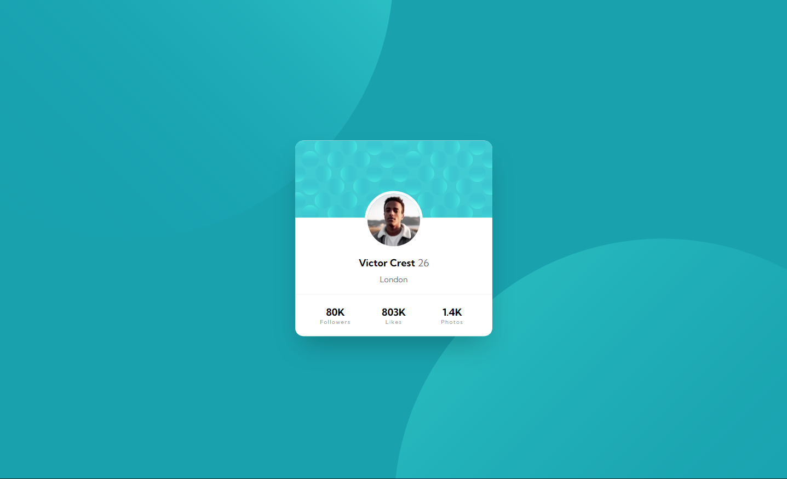
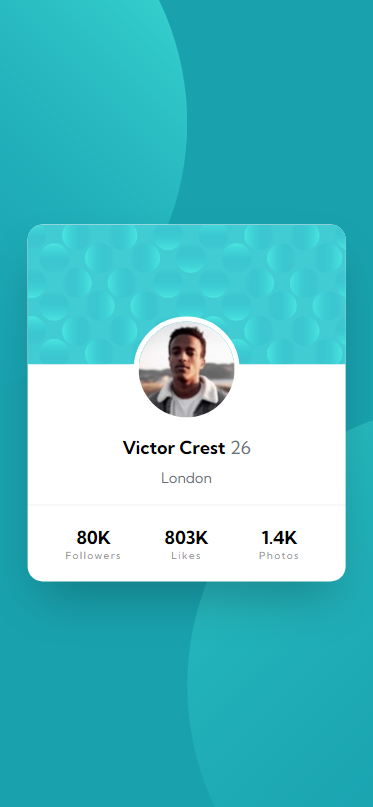

# Frontend Mentor - Profile card component

## Welcome! 👋

Thanks for checking out this front-end coding challenge.

[Frontend Mentor](https://www.frontendmentor.io) challenges help you improve your coding skills by building realistic projects.

## The challenge

### Screenshot

### Links

- Solution URL: [Add solution URL here](https://github.com/frontendmentor-kelvin/profile-card-component-main)
- Live Site URL: [Link](https://frontendmentor-kelvin.github.io/profile-card-component-main/)

## My process

### Built with

- Flexbox
- Mobile-first workflow

### What I learned
- postion absolute inside relative parent

## Author

- Website - [Kelvin](https://github.com/kelvin-lee098)
- Frontend Mentor - [@kelvin-lee098](https://www.frontendmentor.io/profile/kelvin-lee098)
